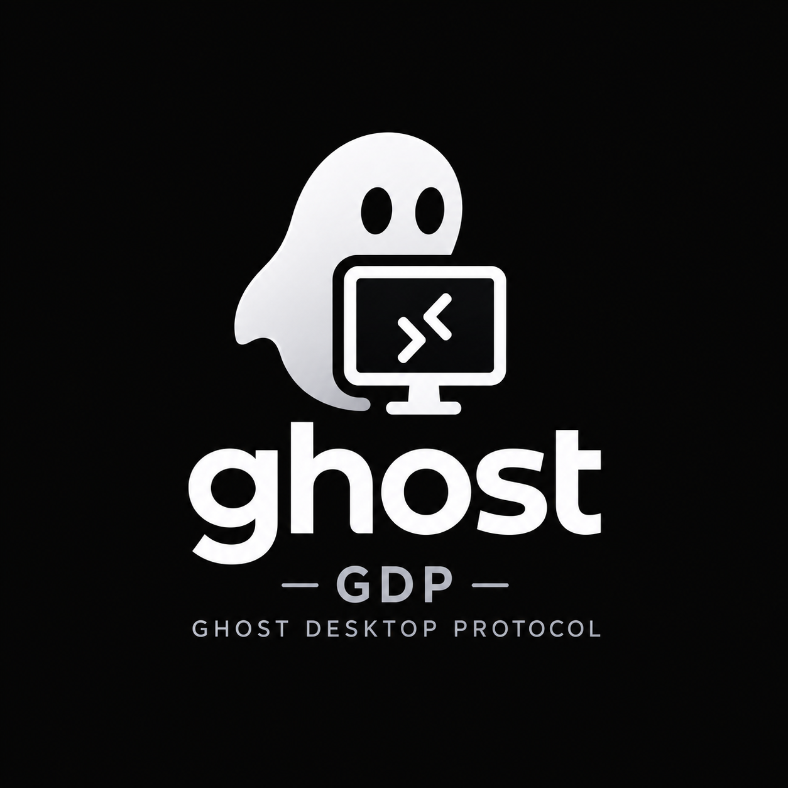

<p align="center">
  
</p>

# ghost

ghost provides remote desktop and game streaming for Linux hosts. A user
signs in from the `spectre` client, and ghost starts that user's desktop
headless on the host and streams it back over GDP, ghost's QUIC-based
protocol.

- **Real desktops.** Sessions run unmodified GNOME, KDE Plasma or LXQt,
  or a single app such as a terminal or Steam Big Picture.
- **Hardware encoding.** H.264, H.265 and AV1 on VA-API or NVENC, with an
  x264 fallback, plus PyroWave for wired LANs and an optional lossless
  layer that keeps settled text pixel-exact.
- **Full input.** Keyboard, pointer, clipboard, gamepads and microphone
  are forwarded, and session audio is sent back.
- **System logins.** Users authenticate through PAM and get a real logind
  session, one per account.
- **Optional broker.** Veil gives users one place to sign in to many
  hosts, with an admin UI, a browser client and PXE-booted thin clients.

## How it works

| Process | Role |
|---|---|
| `ghostd` | Host agent, unprivileged. Authenticates users through `ghostauth` and has `ghostseat` start their sessions. |
| `wraith` | Session agent, one per user. Captures and encodes the desktop, and injects input. |
| `spectre` | Client for Linux, Windows and macOS. Decodes and presents the stream. |
| `spectre-qt` | Login launcher for `spectre`. |
| `veild` | Optional broker (Veil). |

wraith never draws a desktop itself. It attaches as a client to the
session's own compositor, through one of three capture backends:

| Backend | Compositor | Session types |
|---|---|---|
| `screencast-gnome` | `gnome-shell --headless` | GNOME |
| `screencast-kwin` | `kwin_wayland --virtual` | KDE Plasma |
| `screencast-ext` | Any compositor with `ext-image-copy-capture-v1` | Terminal, Steam Big Picture, LXQt (labwc) |

[ARCHITECTURE.md](ARCHITECTURE.md) gives the full picture.

## Repository layout

| Path | Contents |
|---|---|
| `host/` | The server side. A Rust workspace (`ghostd`, `ghostseat`, `ghostlogin`, `veil/` and shared crates), plus `wraith/` (C++) and `proto/` (host-internal schemas) |
| `client/` | `spectre`, `spectre-qt`, and `wisp/` (the thin-client image) |
| `libgdp/` | The shared GDP library: QUIC transport, framing, negotiation, and the wire schemas |
| `packaging/` | Files installed on hosts (systemd, PAM, polkit, udev, session profiles, configs), and the macOS client build |
| `docs/` | Install guides, reference, design docs, decision records, and the protocol spec |

## Build and test

### Prerequisites

You need CMake 3.20 or later, a C++20 compiler, and a stable Rust
toolchain. The host side needs SDL3 and ngtcp2 with its
OpenSSL crypto helper. Supported distributions are Ubuntu 26.04 or later
(used by CI), Fedora 43 or later, and current Arch.

<details>
<summary>Ubuntu / Debian</summary>

```sh
sudo apt install build-essential cmake ninja-build pkg-config git curl \
  protobuf-compiler libprotobuf-dev libssl-dev openssl \
  libngtcp2-dev libngtcp2-crypto-ossl-dev \
  wayland-protocols libwayland-dev libxkbcommon-dev \
  libdrm-dev libva-dev libgbm-dev libx264-dev libzstd-dev \
  libtomlplusplus-dev libpipewire-0.3-dev libopus-dev \
  libei-dev libsystemd-dev \
  libsdl3-dev libavcodec-dev libavutil-dev libvulkan-dev glslang-tools \
  qt6-base-dev libpam0g-dev cargo
```
</details>

<details>
<summary>Fedora</summary>

Enable RPM Fusion (free) first. Fedora's own `ffmpeg-free-devel` lacks
the H.264 decoder, and x264 isn't packaged in Fedora itself.

```sh
sudo dnf install gcc gcc-c++ cmake ninja-build pkgconf-pkg-config git curl \
  protobuf-compiler protobuf-devel openssl-devel openssl \
  ngtcp2-devel ngtcp2-crypto-ossl-devel \
  wayland-protocols-devel wayland-devel libxkbcommon-devel \
  libdrm-devel libva-devel mesa-libgbm-devel x264-devel libzstd-devel \
  tomlplusplus-devel pipewire-devel opus-devel \
  libei-devel systemd-devel \
  SDL3-devel ffmpeg-devel vulkan-loader-devel vulkan-headers glslang \
  qt6-qtbase-devel pam-devel cargo
```
</details>

<details>
<summary>Arch</summary>

```sh
sudo pacman -S --needed base-devel cmake ninja pkgconf git curl \
  protobuf openssl libngtcp2 \
  wayland-protocols wayland libxkbcommon libdrm libva \
  mesa x264 zstd tomlplusplus libpipewire opus libei systemd-libs \
  sdl3 ffmpeg vulkan-icd-loader vulkan-headers glslang \
  qt6-base pam rust
```
</details>

At runtime, a host needs the compositor of each session type it offers
(`labwc`, GNOME or Plasma), and `foot` for the terminal session; a type
whose programs are missing is not listed.

### Build

```sh
make            # build into build/ (RelWithDebInfo)
make test       # C++ unit tests (libgdp, wraith, spectre)
make debug      # unoptimized build into build-debug/
```

Run the Rust tests with `cargo test --workspace` from `host/`. The client
alone also builds on macOS ([packaging/macos/](packaging/macos/README.md))
and Windows ([packaging/windows/](packaging/windows/README.md)).

## Install

- [Session host](docs/install/host.md)
- [Hosts without a GPU](docs/install/gpu-less-hosts.md)
- [Veil broker](docs/install/veil.md)
- [Wisp thin clients](docs/install/wisp.md)
- [Client](docs/install/spectre.md)

## Documentation

| | |
|---|---|
| [ARCHITECTURE.md](ARCHITECTURE.md) | Processes, the login path, and the rules the design depends on |
| [docs/install/](docs/install/) | Setup guides |
| [docs/reference/](docs/reference/) | Configuration, session profiles, command line, files and paths |
| [docs/design/](docs/design/) | How each area works, and its limitations |
| [docs/adr/](docs/adr/README.md) | Architecture decision records |
| [docs/spec/gdp-spec.md](docs/spec/gdp-spec.md) | The GDP wire protocol |
| [TODO.md](TODO.md) | Known gaps |
| [CONTRIBUTING.md](CONTRIBUTING.md) | Building, style, and where documentation goes |

## AI disclosure

This project was written with AI assistance. Design, review, testing
and responsibility for every line are the maintainers'.

## License

ghost is licensed under the [GNU General Public License v3.0 only](COPYING).
libgdp and the GDP specification are [MIT](libgdp/LICENSE), so other
clients and hosts can implement the protocol on any terms. Vendored
third-party files keep their own licenses. License coverage follows
[REUSE](REUSE.toml); run `reuse lint` to check it.
